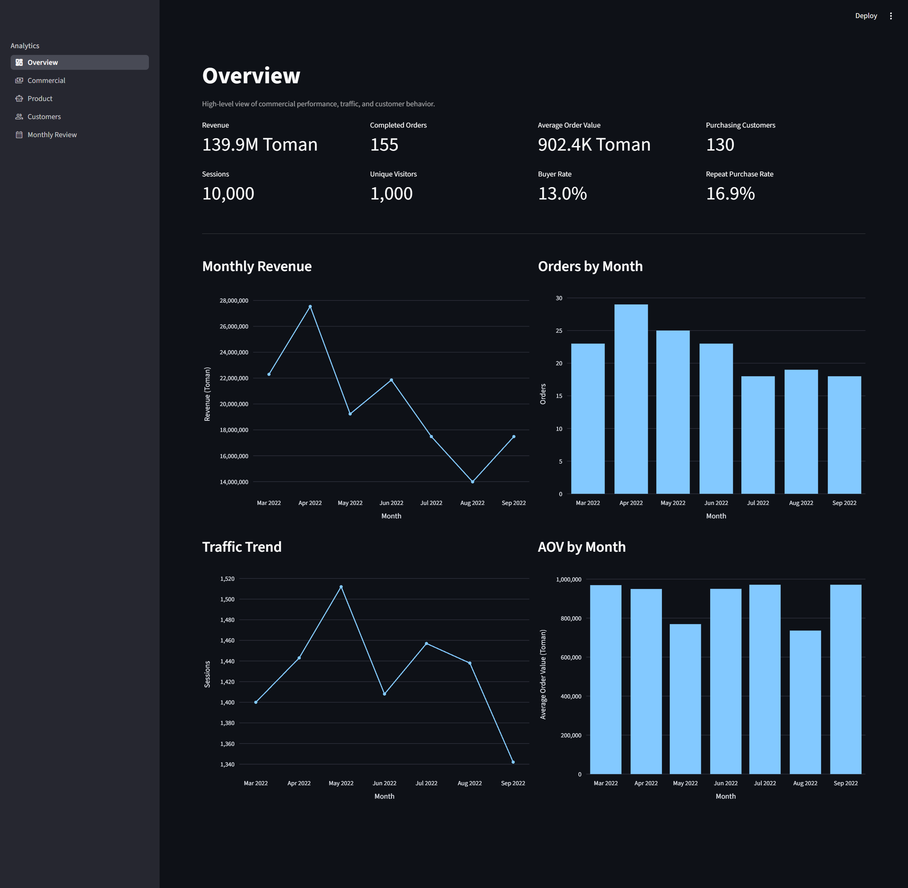
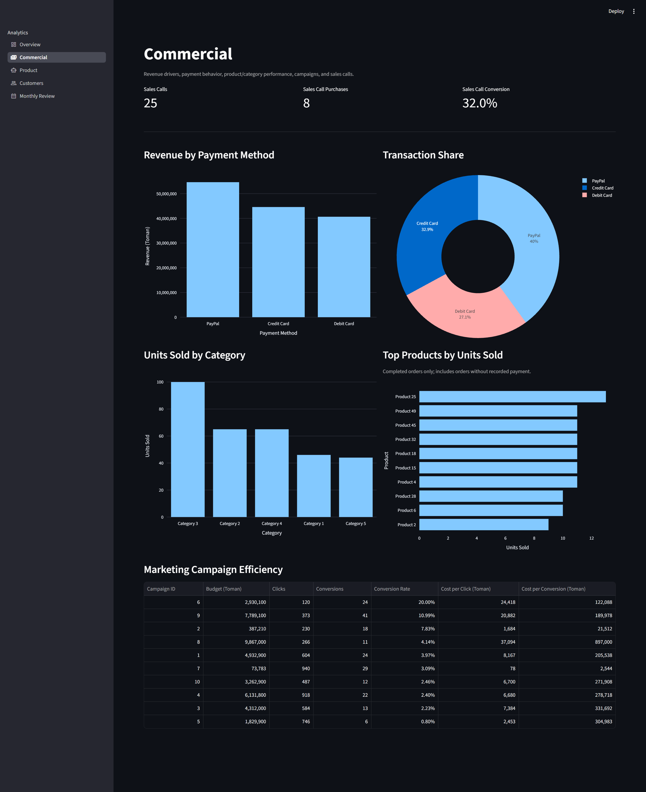
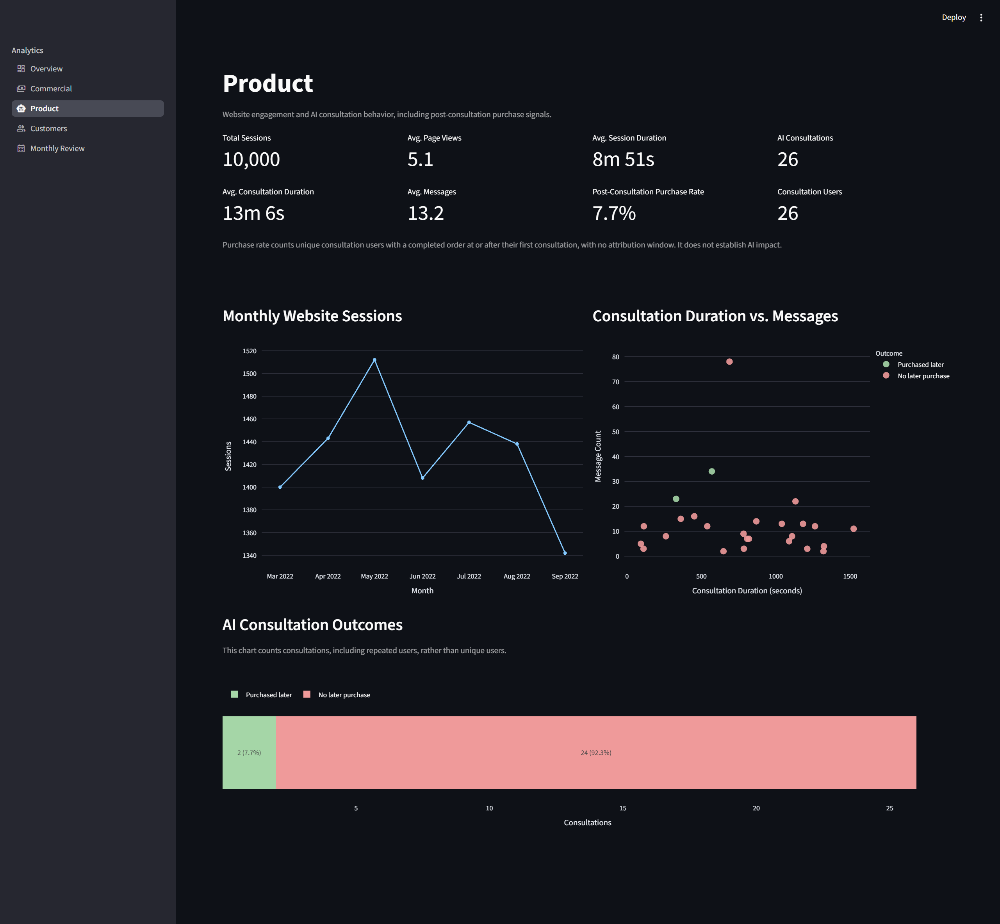
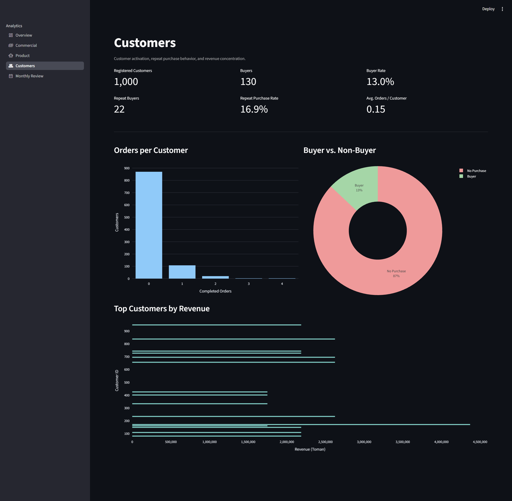
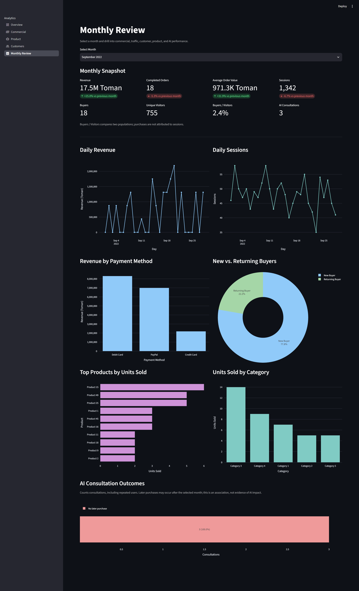

# Bozhan Product Analytics Dashboard

A Streamlit analytics dashboard created for the **Bozhan Product Management Course**.

The project simulates analytics for a beauty e-commerce startup and explores commercial performance, customer behavior, product performance, website activity, and AI consultation outcomes.

> **Note:** The dataset used in this project is arbitrary and created only for training and educational purposes. It does not represent real company or customer data.

## Live Demo

[Open the dashboard on Streamlit Community Cloud](https://bozhan-dashboard.streamlit.app/)

## Screenshots

Click any preview to open the full dashboard screenshot. These previews illustrate the layout; displayed values may differ from the current calculations.

<table>
  <tr>
    <td align="center">
      <a href="assets/screenshots/overview.png">
        
      </a>
      <br>
      <b>Overview</b>
    </td>
    <td align="center">
      <a href="assets/screenshots/commercial.png">
        
      </a>
      <br>
      <b>Commercial</b>
    </td>
    <td align="center">
      <a href="assets/screenshots/product.png">
        
      </a>
      <br>
      <b>Product</b>
    </td>
    <td align="center">
      <a href="assets/screenshots/customers.png">
        
      </a>
      <br>
      <b>Customers</b>
    </td>
    <td align="center">
      <a href="assets/screenshots/monthly_review.png">
        
      </a>
      <br>
      <b>Monthly Review</b>
    </td>
  </tr>
</table>

## Features

- Executive overview with key business KPIs
- Monthly revenue, order, session, and AOV trends
- Month-over-month performance comparison
- Commercial and payment-method analysis
- Product and category performance
- AI consultation analysis
- Customer activation and repeat purchase metrics
- New vs. returning customer analysis
- Monthly drill-down dashboard
- SQLite-backed analytics with explicit SQL queries

## Tech Stack

- Python
- Streamlit
- SQLite
- Pandas
- Plotly
- OpenPyXL

## Project Structure

```text
.
├── app.py
├── pages/
│   ├── overview.py
│   ├── commercial.py
│   ├── product.py
│   ├── customers.py
│   └── monthly_review.py
├── src/
│   ├── db.py
│   ├── queries.py
│   ├── theme.py
│   └── utils.py
├── scripts/
│   └── load_db.py
├── data/
│   ├── startup_data.xlsx
│   └── startup.db
├── assets/
│   └── screenshots/
├── tests/
│   └── test_analytics.py
├── requirements.txt
└── README.md
```

## Run Locally

Use **Python 3.10 or newer**. Run these commands from the project root:

```bash
python -m venv .venv
```

Activate the environment:

- macOS / Linux / WSL: `source .venv/bin/activate`
- Windows PowerShell: `.venv\Scripts\Activate.ps1`

Then install the tested dependency versions and start the dashboard:

```bash
python -m pip install -r requirements.txt
python -m streamlit run app.py
```

Open the local URL printed by Streamlit (usually `http://localhost:8501`).
The repository includes the Excel workbook and a ready-to-use SQLite database.
If `data/startup.db` is absent, the app creates it from the workbook on startup.

## Reload the Dataset

After changing the workbook, explicitly rebuild the database:

```bash
python -m scripts.load_db --reset
```

To use other input and output paths:

```bash
python -m scripts.load_db --excel path/to/workbook.xlsx --db path/to/analytics.db --reset
```

The dashboard reads `data/startup.db`; a custom `--db` path is useful for validating
an import separately. The loader checks required sheets and columns, rejects null
and fractional integer fields, and enforces database constraints. An import failure
rolls back all inserted rows and, when using `--reset`, preserves the previous data.
Without `--reset`, the loader appends rows; importing the same IDs again fails
rather than creating duplicates. Restart or rerun the dashboard after a reload.

## Metric Definitions and Assumptions

| Metric | Definition |
| --- | --- |
| Revenue | Sum of recorded transaction amounts for orders with status `Completed`. |
| Completed orders | Distinct completed orders, including those without a recorded transaction. |
| Average order value (AOV) | Revenue divided by completed orders, rather than by transactions. |
| Units sold | Order-detail quantities for completed orders, counted once regardless of the number of payments. |
| Allocated product revenue | Each completed order's total payments distributed across its products in proportion to unit quantity. This is an estimate because item prices are unavailable. |
| Buyer rate (Overview / Customers) | Customers with at least one completed order divided by all registered customers. |
| Buyers / Visitors (Monthly Review) | Distinct buyers divided by distinct visitors in the selected month. These populations are not matched; this is not a session conversion rate and can exceed 100%. |
| Repeat purchase rate | Customers with more than one completed order divided by customers with at least one completed order. |
| New / returning buyers | New buyers make their first completed purchase in the selected month; returning buyers first purchased in an earlier month. |
| Post-consultation purchase rate | Unique consultation users with a completed order at or after their first consultation divided by all unique consultation users. |
| Consultation outcome charts | Consultation events with any completed purchase at or after that event. Repeated consultations by one user count separately. |
| Month-over-month change | Comparison with the immediately preceding calendar month. A delta is omitted when that month has no activity or its metric is zero. |

Commercial totals exclude returned orders. Monthly revenue is grouped by **order
date**, even when the payment occurs later. This is an educational sales view,
not cash-flow or refund accounting. Average transaction value remains a
transaction-level metric in payment summaries.

All monetary values are displayed as **Toman**. Dollar signs in source currency
strings are removed as formatting; the loader does not perform currency conversion.
Consultation outcomes have no fixed attribution window and may include purchases
after the selected month. They describe association and do not demonstrate that
AI consultations caused purchases. Campaign conversions and sales-call purchases
come from their source records and are not attributed to individual orders.
Inventory is a static workbook snapshot.

## Validation

Run the regression suite with the same environment:

```bash
python -m unittest discover -s tests -v
```

Tests cover completed-order filtering, split payments, missing payments, AOV,
empty datasets, consultation outcomes, calendar-month comparisons, workbook
reloads, failed-import rollback, and Streamlit page execution.
Tests use temporary databases and leave the supplied dataset unchanged.

## Deployment

For Streamlit Community Cloud, use `app.py` as the entry point and
`requirements.txt` for dependencies. Include `data/startup_data.xlsx`,
`data/startup.db`, `.streamlit/config.toml`, and the assets in the repository.
The theme is configured in `.streamlit/config.toml`.

## License

This project is distributed under the [MIT License](LICENSE).
